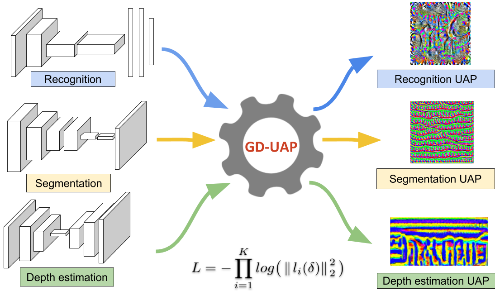

# GD-UAP

<center>  </center>
  
Code for the paper [Generalizable Data-free Objective for Crafting Universal Adversarial Perturbations](https://arxiv.org/abs/1801.08092)

Accepted in **IEEE Transactions on Pattern Analysis and Machine Intelligence**!

Mopuri Konda Reddy*,Aditya Ganeshan*, R. Venkatesh Babu

###### * = equal contribution 

This repository contains code to craft and evaluate GD-UAP on the following task:

1) Classification.

2) Segmentation.

3) Depth Estimation.

Please look into each of the folders for usage instructions.

## Precomputed Perturbations

Perturbations crafted using the proposed algorithm are provided in this [link](https://www.dropbox.com/s/ixjzg4itx10nhid/perturbations.tar.gz?dl=0). After extracting them, and placing them in the respective folders (In each task), you can use the evaluation code provided in each task for evaluation.

## Reference

```
@article{gduap-mopuri-2018,
title={Generalizable Data-free Objective for Crafting Universal Adversarial
  Perturbations},
author={Mopuri, Konda Reddy and Ganeshan, Aditya and Babu, R Venkatesh},
booktitle = {arXiv preprint arXiv: 1801.08092 },
year = {2018}
}
```
#### Drop a mail [here](mailto:adityaganeshan@gmail.com) in case of any queries!

