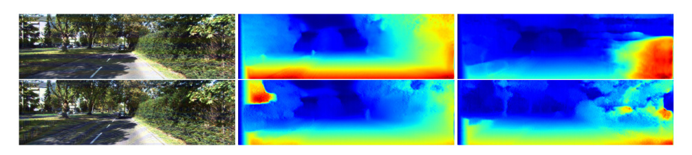

# GD-UAP for Depth Estimation

Code for the paper [Generalizable Data-free Objective for Crafting Universal Adversarial Perturbations](https://arxiv.org/abs/1801.08092)

Mopuri Konda Reddy* ,Aditya Ganeshan*, R. Venkatesh Babu

###### * = equal contribution 

This section contains code to craft and evaluate GD-UAP on the task of depth-estimation using Tensorflow.

## Precomputed Perturbations

Perturbations crafted using the proposed algorithm are provided in this [link](https://www.dropbox.com/s/ixjzg4itx10nhid/perturbations.tar.gz?dl=0). After extracting them, and placing them in the respective folders (In each task), you can use the evaluation code provided in each task for evaluation.

## Usage Instructions

### 1) Preparation

For training and evaluation, the following steps must be followed: 

1) Download the KITTI dataset, for testing and training, and  PLACES-205 dataset for the validation. Kindly look [here](http://www.cvlibs.net/datasets/kitti/raw_data.php) and [here](http://places.csail.mit.edu/downloadData.html) for these datasets respectively.

2) The files for training images, testing images has been provided by [monodepth](https://github.com/mrharicot/monodepth), and are saved in `monodepth_files/filenames/`. For making a validation set using PLACES-205 dataset, the file `utils/places_205.txt` has been provided, which contains the list of Places-205 Files (Used for creating the validation dataset).

3) Use scripts `make_gaussian_noise.py`, `make_preprocessed_data.py` provided in `data/` to make the gaussian sample (for range prior training) and the validation dataset.

4) Use the script `weights/download_weights.sh` to download the weights for `Monodepth Resnet50 Eigen` and `Monodepth VGG Eigen`. 

5) ** For only evaluation: ** Follow steps 1,2 and 4. Download and save the precomputed perturbations from this [link](https://www.dropbox.com/s/ixjzg4itx10nhid/perturbations.tar.gz?dl=0), and save the depth-estimation perturbations in the `perturbations/` folder.

### 2) Training

To train a perturbation you can use the `train.py` script. For example to train/craft a perturbation for `Monodepth VGG Eigen`, with data priors, use the following command:

```
python train.py --encoder vgg --prior_type with_data --img_list monodepth_files/filenames/eigen_train_files.txt --batch_size 10 --checkpoint_file weights/model_eigen
```

This will run an optimization process proposed in the paper to craft a UAP for `Monodepth VGG Eigen` with data-priors. The resultant perturbation is saved in `perturbations/`.


### 3) Testing

Evaluating the performance of a perturbation on the KITTI Eigen split test dataset is a two step process. First, use the `get_outputs.py` script.This will save the disparity maps for normal and perturbed images as `.npy` files. For example, to get the output of the perturbation `perturbations/monodepth_vgg_with_data.npy` on `Monodepth VGG Eigen` architecture, use the following command:

```
# To save output of normal Input
python get_outputs.py --encoder vgg --data_path <add-path-to-kitti>  --adv_im perturbations/zero_perturbation.npy --im_list monodepth_files/filenames/eigen_test_files.txt --output_directory output/ --output_name normal

# To save output of Perturbed Input
python get_outputs.py --encoder vgg --data_path <add-path-to-kitti> --adv_im perturbations/monodepth_vgg_with_data.npy --im_list monodepth_files/filenames/eigen_test_files.txt  --output_directory output/ --output_name perturbed
```

This command will save the predicted disparity maps for normal and perturbed images as `output/disparities_normal.npy` and `output/disparities_perturbed.npy` respectively.

To find the Fooling rate and other metrics from the output, we use modified version of scripts provided by [monodepth](https://github.com/mrharicot/monodepth). After the previous step, to find the various metrics of perturbed prediction w.r.t. normal prediction (which can then be used to find the fooling rate), use the `monodepth_files/eval_test.py` script as follows:

```
python monodepth_files/evaluate_kitti.py --split eigen --predicted_disp_path output/disparities_perturbed.npy --gt_path <add-path-to-kitti> --garg_crop
```
 
To find the various metrics of perturbed prediction w.r.t. ground truth, use the `monodepth_files/evaluate_kitty.py` script as follows:


```
python monodepth_files/eval_test.py --split eigen --predicted_disp_path output/disparities_perturbed.npy --prev_pred output/disparities_normal.npy --gt_path /data1/aditya/kitti_dataset/data/ --garg_crop 
```
 

## Results

These are some results taken from the paper:

### Quantitative Results

**  Kindly read the paper to understand the results presented.**

|Model     | Abs Rel | Sq Rel | RMSE | RMSE log | delta<1.25 | delta<1.25^2 |delta<1.25^3 |
|------------|-----|-----|-----|-----|-----|-----|-----|
|Normal Resnet50    | 0.133 | 1.148    |5.549 |0.230 |0.829 |0.935  |0.970 |
|Baseline Resnet50   | 0.1339 | 1.1591    |5.576 |0.231 |0.827 |0.934 |0.969 |
|Range prior Resnet50 | 0.319 | 3.292    |9.064 |**0.640** |**0.460** |**0.611** |**0.717**|
|Data prior Resnet50 | **0.380** | **10.278**    |**10.976** |0.402 |0.708 |0.842 |0.900|
|------------|-----|-----|-----|-----|-----|-----|-----|
|Normal VGG    | 0.148 | 1.344   |5.927 |0.247 |0.803 |0.922  |0.964 |
|Baseline VGG   | 0.149 | 1.353    |5.949 |0.248 |0.800 |0.920 |0.963 |
|Range prior VGG | 0.212 | 2.073    |6.994 |**0.364** |**0.658** |**0.825** |**0.906**|
|Data prior VGG | **0.355** | **9.612**    |**10.592** |0.390 |0.714 |0.850 |0.908|
|------------|-----|-----|-----|-----|-----|-----|-----|
|Train set mean | 0.361 | 4.826    |8.102 |0.377 |0.638 |0.804 |0.894|

## Acknowledgement

Without the following works, this work would not have been possible. We whole-heartedly acknowledge the contribution from the following:

* [Fast Feature Fool](https://github.com/val-iisc/fast-feature-fool), and Universal Adversarial Perturbations(https://github.com/LTS4/universal). 

* [The KITTI Vision Benchmark Suite](http://www.cvlibs.net/datasets/kitti/) and [Places-205 Dataset](http://places.csail.mit.edu/).

* [MonoDepth](https://github.com/mrharicot/monodepth).


